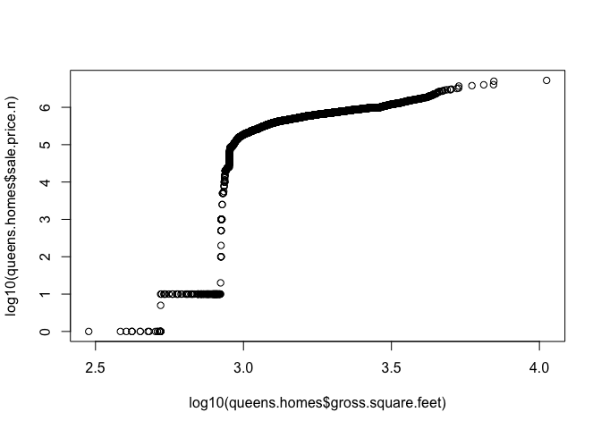
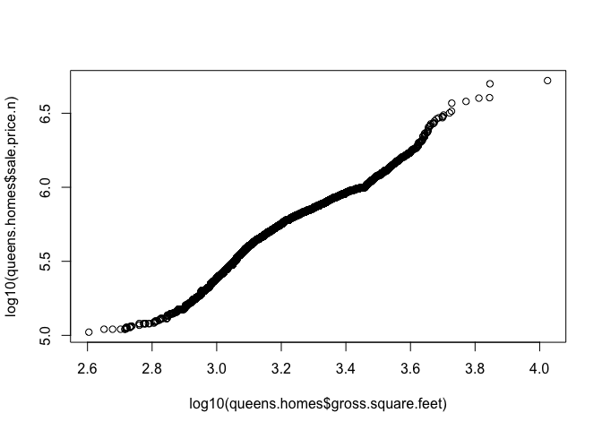
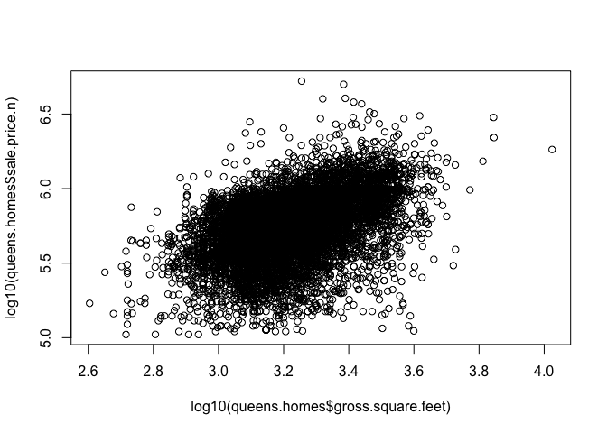
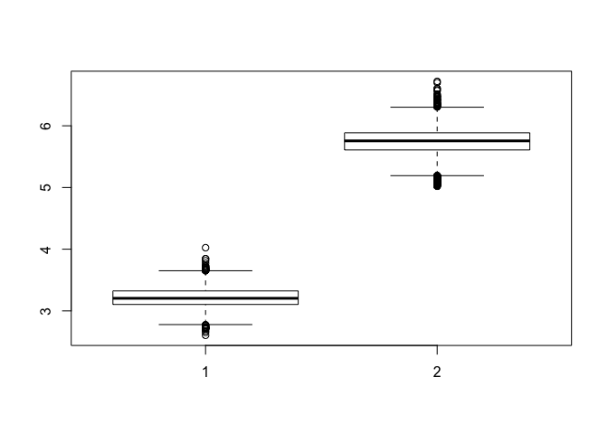
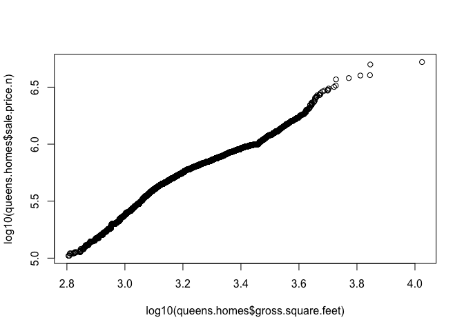
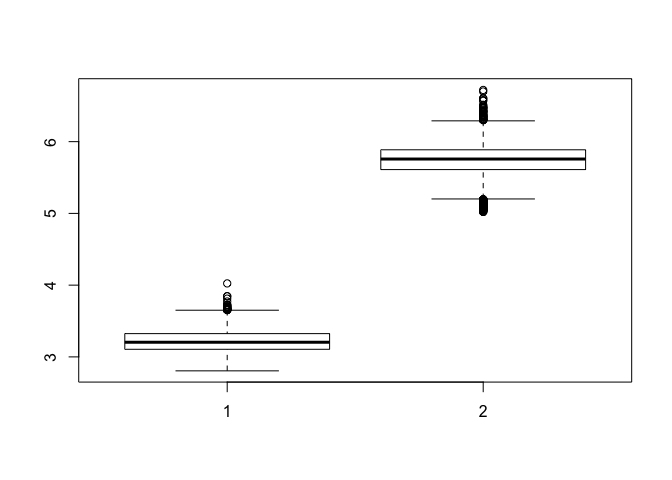
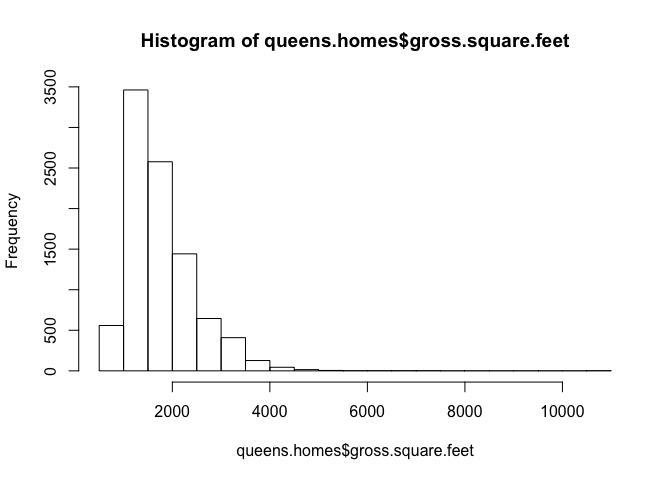
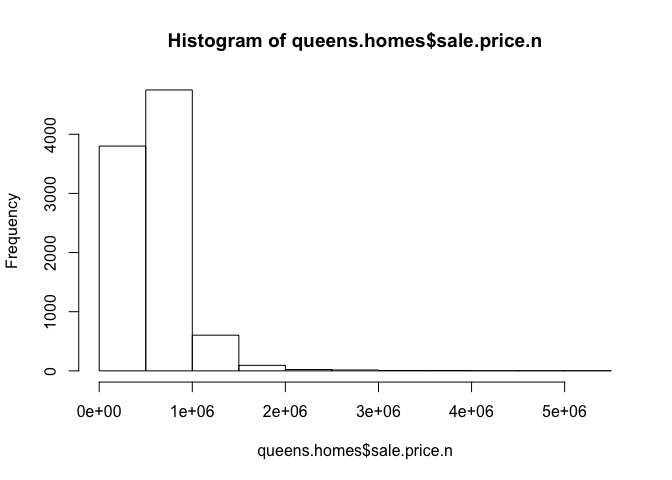

# Week 4 Group Project Using Queens Data
Group2 - Tony Garza  
June 8, 2016  


## R Markdown Analysis Report

This is the code used to both scrub and analyze the data. This R Markdown document will culminate with a series of plots using the Queens data. The plots will be used to determine any potential patterns as well as whether or not we are working with a normal distribution at all.

##Load the Data

```r
require(plyr)
```

```
## Loading required package: plyr
```

```r
require(gdata)
```

```
## Loading required package: gdata
```

```
## gdata: read.xls support for 'XLS' (Excel 97-2004) files ENABLED.
```

```
## 
```

```
## gdata: read.xls support for 'XLSX' (Excel 2007+) files ENABLED.
```

```
## 
## Attaching package: 'gdata'
```

```
## The following object is masked from 'package:stats':
## 
##     nobs
```

```
## The following object is masked from 'package:utils':
## 
##     object.size
```

```
## The following object is masked from 'package:base':
## 
##     startsWith
```

```r
# Read the raw data from rollingsales_queens.xls into variable queens
## Need to download the perl interpreter for Windows (ran this one on a Mac though).  http://strawberryperl.com/
queens <- read.xls("rollingsales_queens.xls", pattern = "BOROUGH")
```
##Explore the Data
Let's view the data to make sure it loaded correctly.

```r
head(queens)
```

```
##   BOROUGH              NEIGHBORHOOD
## 1       4 AIRPORT JFK              
## 2       4 AIRPORT LA GUARDIA       
## 3       4 AIRPORT LA GUARDIA       
## 4       4 AIRPORT LA GUARDIA       
## 5       4 AIRPORT LA GUARDIA       
## 6       4 AIRPORT LA GUARDIA       
##                        BUILDING.CLASS.CATEGORY TAX.CLASS.AT.PRESENT BLOCK
## 1 31  COMMERCIAL VACANT LAND                                      4 14260
## 2 01  ONE FAMILY DWELLINGS                                        1   976
## 3 03  THREE FAMILY DWELLINGS                                      1   949
## 4 03  THREE FAMILY DWELLINGS                                      1   949
## 5 03  THREE FAMILY DWELLINGS                                      1   976
## 6 39  TRANSPORTATION FACILITIES                                   4   926
##   LOT EASE.MENT BUILDING.CLASS.AT.PRESENT
## 1  70        NA                        V1
## 2  13        NA                        A5
## 3  51        NA                        C0
## 4  52        NA                        C0
## 5  38        NA                        C0
## 6   1        NA                        T1
##                                     ADDRESS APARTMENT.NUMBER ZIP.CODE
## 1 181-25 EASTERN ROAD                                           11430
## 2 21-16 81ST   STREET                                           11370
## 3 19-79 80TH STREET                                             11370
## 4 19-77 80TH STREET                                             11370
## 5 21-66 81ST STREET                                             11370
## 6 83-00 23RD   AVENUE                                           11370
##   RESIDENTIAL.UNITS COMMERCIAL.UNITS TOTAL.UNITS LAND.SQUARE.FEET
## 1                 0                0           0           223027
## 2                 1                0           1             1800
## 3                 3                0           3             2000
## 4                 3                0           3             2000
## 5                 3                0           3             2100
## 6                 0                4           4         29305534
##   GROSS.SQUARE.FEET YEAR.BUILT TAX.CLASS.AT.TIME.OF.SALE
## 1                 0          0                         4
## 2              1224       1950                         1
## 3              2635       1945                         1
## 4              2835       1945                         1
## 5              2016       1950                         1
## 6           2949024       1933                         4
##   BUILDING.CLASS.AT.TIME.OF.SALE  SALE.PRICE  SALE.DATE
## 1                             V1 $ 7,800,000 2016-01-14
## 2                             A5   $ 620,000 2015-10-06
## 3                             C0         $ 0 2015-06-26
## 4                             C0         $ 0 2015-08-13
## 5                             C0         $ 0 2015-12-15
## 6                             T1         $ 0 2015-07-22
```
Let's continue to explore the data:

```r
str(queens)
```

```
## 'data.frame':	25124 obs. of  21 variables:
##  $ BOROUGH                       : int  4 4 4 4 4 4 4 4 4 4 ...
##  $ NEIGHBORHOOD                  : Factor w/ 61 levels "AIRPORT JFK              ",..: 1 2 2 2 2 2 3 3 3 3 ...
##  $ BUILDING.CLASS.CATEGORY       : Factor w/ 42 levels "01  ONE FAMILY DWELLINGS                    ",..: 27 1 3 3 3 35 1 1 1 1 ...
##  $ TAX.CLASS.AT.PRESENT          : Factor w/ 9 levels "1","1A","1B",..: 9 1 1 1 1 9 1 1 1 1 ...
##  $ BLOCK                         : int  14260 976 949 949 976 926 15828 15830 15837 15837 ...
##  $ LOT                           : int  70 13 51 52 38 1 53 42 17 17 ...
##  $ EASE.MENT                     : logi  NA NA NA NA NA NA ...
##  $ BUILDING.CLASS.AT.PRESENT     : Factor w/ 114 levels "A0","A1","A2",..: 106 6 14 14 14 104 2 3 7 7 ...
##  $ ADDRESS                       : Factor w/ 22157 levels "1 ASCAN AVE, 1B                          ",..: 7645 8652 7960 7958 8756 19081 11505 12371 12174 12174 ...
##  $ APARTMENT.NUMBER              : Factor w/ 1135 levels "            ",..: 1 1 1 1 1 1 1 1 1 1 ...
##  $ ZIP.CODE                      : int  11430 11370 11370 11370 11370 11370 11691 11691 11691 11691 ...
##  $ RESIDENTIAL.UNITS             : int  0 1 3 3 3 0 1 1 1 1 ...
##  $ COMMERCIAL.UNITS              : int  0 0 0 0 0 4 0 0 0 0 ...
##  $ TOTAL.UNITS                   : int  0 1 3 3 3 4 1 1 1 1 ...
##  $ LAND.SQUARE.FEET              : int  223027 1800 2000 2000 2100 29305534 3810 1766 3804 3804 ...
##  $ GROSS.SQUARE.FEET             : int  0 1224 2635 2835 2016 2949024 1200 1521 745 745 ...
##  $ YEAR.BUILT                    : int  0 1950 1945 1945 1950 1933 2002 1920 1925 1925 ...
##  $ TAX.CLASS.AT.TIME.OF.SALE     : int  4 1 1 1 1 4 1 1 1 1 ...
##  $ BUILDING.CLASS.AT.TIME.OF.SALE: Factor w/ 116 levels "A0","A1","A2",..: 108 6 14 14 14 106 2 3 7 7 ...
##  $ SALE.PRICE                    : Factor w/ 3220 levels "$ 0","$ 1","$ 1,000",..: 2707 2509 1 1 1 1 1158 1 1242 2673 ...
##  $ SALE.DATE                     : Factor w/ 347 levels "2015-05-01","2015-05-02",..: 246 149 54 97 217 78 291 270 251 20 ...
```

```r
summary(queens)
```

```
##     BOROUGH                     NEIGHBORHOOD  
##  Min.   :4   FLUSHING-NORTH           : 2572  
##  1st Qu.:4   FOREST HILLS             : 1185  
##  Median :4   BAYSIDE                  : 1068  
##  Mean   :4   ASTORIA                  : 1042  
##  3rd Qu.:4   JACKSON HEIGHTS          : 1037  
##  Max.   :4   FLUSHING-SOUTH           :  822  
##              (Other)                  :17398  
##                                  BUILDING.CLASS.CATEGORY
##  01  ONE FAMILY DWELLINGS                    :7860      
##  02  TWO FAMILY DWELLINGS                    :5247      
##  10  COOPS - ELEVATOR APARTMENTS             :3763      
##  13  CONDOS - ELEVATOR APARTMENTS            :1868      
##  09  COOPS - WALKUP APARTMENTS               :1279      
##  03  THREE FAMILY DWELLINGS                  :1217      
##  (Other)                                     :3890      
##  TAX.CLASS.AT.PRESENT     BLOCK            LOT         EASE.MENT     
##  1      :14389        Min.   :   13   Min.   :   1.0   Mode:logical  
##  2      : 7387        1st Qu.: 2702   1st Qu.:  16.0   NA's:25124    
##  4      : 1760        Median : 5843   Median :  39.0                 
##  2A     :  612        Mean   : 6554   Mean   : 208.7                 
##  1A     :  384        3rd Qu.: 9968   3rd Qu.:  82.0                 
##  1B     :  365        Max.   :16322   Max.   :7097.0                 
##  (Other):  227                                                       
##  BUILDING.CLASS.AT.PRESENT
##  D4     : 3763            
##  A1     : 3606            
##  A5     : 1954            
##  R4     : 1864            
##  B3     : 1773            
##  B2     : 1747            
##  (Other):10417            
##                                       ADDRESS          APARTMENT.NUMBER
##  41-23 CRESCENT STREET                    :  152               :22029  
##  120 BEACH 26 STREET                      :  127   3A          :   56  
##  142-28 38TH   AVENUE                     :   74   2A          :   54  
##  65-20 BOOTH STREET                       :   67   3B          :   47  
##  108-20 71ST    AVENUE                    :   55   2B          :   45  
##  106-20 70TH   AVENUE                     :   45   4B          :   42  
##  (Other)                                  :24604   (Other)     : 2851  
##     ZIP.CODE     RESIDENTIAL.UNITS COMMERCIAL.UNITS  TOTAL.UNITS    
##  Min.   :    0   Min.   :  0.000   Min.   :  0.00   Min.   :  0.00  
##  1st Qu.:11361   1st Qu.:  0.000   1st Qu.:  0.00   1st Qu.:  1.00  
##  Median :11375   Median :  1.000   Median :  0.00   Median :  1.00  
##  Mean   :11367   Mean   :  1.493   Mean   :  0.11   Mean   :  1.63  
##  3rd Qu.:11419   3rd Qu.:  2.000   3rd Qu.:  0.00   3rd Qu.:  2.00  
##  Max.   :11694   Max.   :442.000   Max.   :123.00   Max.   :442.00  
##                                                                     
##  LAND.SQUARE.FEET   GROSS.SQUARE.FEET   YEAR.BUILT  
##  Min.   :       0   Min.   :      0   Min.   :   0  
##  1st Qu.:       0   1st Qu.:      0   1st Qu.:1925  
##  Median :    2064   Median :   1268   Median :1945  
##  Mean   :    3712   Mean   :   1944   Mean   :1859  
##  3rd Qu.:    3310   3rd Qu.:   1994   3rd Qu.:1960  
##  Max.   :29305534   Max.   :2949024   Max.   :2016  
##                                                     
##  TAX.CLASS.AT.TIME.OF.SALE BUILDING.CLASS.AT.TIME.OF.SALE
##  Min.   :1.000             D4     : 3763                 
##  1st Qu.:1.000             A1     : 3607                 
##  Median :1.000             A5     : 1956                 
##  Mean   :1.537             R4     : 1868                 
##  3rd Qu.:2.000             B3     : 1752                 
##  Max.   :4.000             B2     : 1740                 
##                            (Other):10438                 
##      SALE.PRICE         SALE.DATE    
##  $ 0      : 7488   2016-01-20:  250  
##  $ 10     :  206   2016-04-05:  183  
##  $ 450,000:  161   2015-08-13:  181  
##  $ 400,000:  143   2015-06-18:  169  
##  $ 300,000:  142   2016-02-29:  160  
##  $ 600,000:  132   2015-10-29:  153  
##  (Other)  :16852   (Other)   :24028
```
##Clean the Data
Now let's start cleaning up the data: <br/>
1. First let's convert all labels to lower case to make things easier/consistent.

```r
names(queens) <- tolower(names(queens))
```
2. Let's make sure our data is all numeric

```r
queens$sale.price.n <- as.numeric(gsub("[^[:digit:]]","", queens$sale.price))
count(is.na(queens$sale.price.n))
```

```
##       x  freq
## 1 FALSE 25124
```

```r
queens$gross.sqft <- as.numeric(gsub("[^[:digit:]]","",queens$gross.square.feet))
count(is.na(queens$gross.square.feet))
```

```
##       x  freq
## 1 FALSE 25124
```
3. Let's now keep only the actual sales:

```r
queens.sale <- queens[queens$sale.price.n!= 0,]
summary(queens.sale)
```

```
##     borough                     neighborhood  
##  Min.   :4   FLUSHING-NORTH           : 1665  
##  1st Qu.:4   FOREST HILLS             :  978  
##  Median :4   JACKSON HEIGHTS          :  822  
##  Mean   :4   BAYSIDE                  :  817  
##  3rd Qu.:4   FLUSHING-SOUTH           :  625  
##  Max.   :4   ASTORIA                  :  568  
##              (Other)                  :12161  
##                                  building.class.category
##  01  ONE FAMILY DWELLINGS                    :5563      
##  02  TWO FAMILY DWELLINGS                    :3479      
##  10  COOPS - ELEVATOR APARTMENTS             :3422      
##  13  CONDOS - ELEVATOR APARTMENTS            :1231      
##  09  COOPS - WALKUP APARTMENTS               :1207      
##  03  THREE FAMILY DWELLINGS                  : 669      
##  (Other)                                     :2065      
##  tax.class.at.present     block            lot         ease.ment     
##  1      :9730         Min.   :   15   Min.   :   1.0   Mode:logical  
##  2      :6235         1st Qu.: 2728   1st Qu.:  14.0   NA's:17636    
##  4      : 755         Median : 5938   Median :  36.0                 
##  2A     : 374         Mean   : 6589   Mean   : 186.8                 
##  1A     : 296         3rd Qu.:10015   3rd Qu.:  76.0                 
##  1B     : 113         Max.   :16322   Max.   :7097.0                 
##  (Other): 133                                                        
##  building.class.at.present
##  D4     :3422             
##  A1     :2604             
##  A5     :1403             
##  B3     :1246             
##  R4     :1229             
##  C6     :1207             
##  (Other):6525             
##                                       address          apartment.number
##  108-20 71ST    AVENUE                    :   55               :15824  
##  108-20 71ST   AVENUE                     :   43   2A          :   46  
##  2 BAY CLUB DRIVE                         :   28   3A          :   44  
##  106-20 70TH   AVENUE                     :   26   2B          :   34  
##  42-37 27TH STREET                        :   22   3B          :   34  
##  41-42 COLLEGE POINT BOULEV               :   21   4A          :   32  
##  (Other)                                  :17441   (Other)     : 1622  
##     zip.code     residential.units commercial.units    total.units     
##  Min.   :    0   Min.   :  0.000   Min.   : 0.00000   Min.   :  0.000  
##  1st Qu.:11362   1st Qu.:  0.000   1st Qu.: 0.00000   1st Qu.:  0.000  
##  Median :11375   Median :  1.000   Median : 0.00000   Median :  1.000  
##  Mean   :11372   Mean   :  1.395   Mean   : 0.08931   Mean   :  1.494  
##  3rd Qu.:11419   3rd Qu.:  2.000   3rd Qu.: 0.00000   3rd Qu.:  2.000  
##  Max.   :11694   Max.   :442.000   Max.   :55.00000   Max.   :442.000  
##                                                                        
##  land.square.feet gross.square.feet   year.built  
##  Min.   :     0   Min.   :     0    Min.   :   0  
##  1st Qu.:     0   1st Qu.:     0    1st Qu.:1928  
##  Median :  2000   Median :  1216    Median :1945  
##  Mean   :  2338   Mean   :  1686    Mean   :1884  
##  3rd Qu.:  3125   3rd Qu.:  1846    3rd Qu.:1960  
##  Max.   :371900   Max.   :540916    Max.   :2016  
##                                                   
##  tax.class.at.time.of.sale building.class.at.time.of.sale
##  Min.   :1.000             D4     :3422                  
##  1st Qu.:1.000             A1     :2603                  
##  Median :1.000             A5     :1405                  
##  Mean   :1.511             R4     :1231                  
##  3rd Qu.:2.000             B3     :1229                  
##  Max.   :4.000             C6     :1207                  
##                            (Other):6539                  
##      sale.price         sale.date      sale.price.n         gross.sqft    
##  $ 10     :  206   2015-07-15:  121   Min.   :        1   Min.   :     0  
##  $ 450,000:  161   2015-07-30:  119   1st Qu.:   250000   1st Qu.:     0  
##  $ 400,000:  143   2015-08-27:  117   Median :   440000   Median :  1216  
##  $ 300,000:  142   2015-07-28:  114   Mean   :   720588   Mean   :  1686  
##  $ 600,000:  132   2016-02-29:  114   3rd Qu.:   699500   3rd Qu.:  1846  
##  $ 650,000:  130   2015-10-29:  111   Max.   :292357933   Max.   :540916  
##  (Other)  :16722   (Other)   :16940
```
4. This is still a lot of data points so let's also just look at 1-, 2-, and  3-family homes:

```r
queens.homes <- queens.sale[which(grepl("FAMILY", queens.sale$building.class.category)),]
summary(queens.homes)
```

```
##     borough                     neighborhood 
##  Min.   :4   FLUSHING-NORTH           : 709  
##  1st Qu.:4   BAYSIDE                  : 417  
##  Median :4   RICHMOND HILL            : 413  
##  Mean   :4   QUEENS VILLAGE           : 394  
##  3rd Qu.:4   ST. ALBANS               : 385  
##  Max.   :4   SO. JAMAICA-BAISLEY PARK : 361  
##              (Other)                  :7032  
##                                  building.class.category
##  01  ONE FAMILY DWELLINGS                    :5563      
##  02  TWO FAMILY DWELLINGS                    :3479      
##  03  THREE FAMILY DWELLINGS                  : 669      
##  04  TAX CLASS 1 CONDOS                      :   0      
##  05  TAX CLASS 1 VACANT LAND                 :   0      
##  06  TAX CLASS 1 - OTHER                     :   0      
##  (Other)                                     :   0      
##  tax.class.at.present     block            lot          ease.ment     
##  1      :9705         Min.   :   30   Min.   :   1.00   Mode:logical  
##  1B     :   3         1st Qu.: 4170   1st Qu.:  19.00   NA's:9711     
##  4      :   2         Median : 8814   Median :  36.00                 
##  2A     :   1         Mean   : 8097   Mean   :  53.86                 
##  1A     :   0         3rd Qu.:11574   3rd Qu.:  60.00                 
##  1C     :   0         Max.   :16322   Max.   :2707.00                 
##  (Other):   0                                                         
##  building.class.at.present
##  A1     :2604             
##  A5     :1403             
##  B3     :1246             
##  B2     :1190             
##  A2     : 983             
##  B1     : 839             
##  (Other):1446             
##                                       address         apartment.number
##  42-18 74TH   STREET                      :   7               :9709   
##  BELL BOULEVARD                           :   4   1           :   1   
##  130-43 116TH STREET                      :   3   1405        :   1   
##  179-47 ANDERSON ROAD                     :   3   1-A         :   0   
##  20-17 120TH   STREET                     :   3   1-C         :   0   
##  257-50 148TH AVENUE                      :   3   1-D         :   0   
##  (Other)                                  :9688   (Other)     :   0   
##     zip.code     residential.units commercial.units   total.units   
##  Min.   :11001   Min.   :1.000     Min.   :0.00000   Min.   :1.000  
##  1st Qu.:11366   1st Qu.:1.000     1st Qu.:0.00000   1st Qu.:1.000  
##  Median :11412   Median :1.000     Median :0.00000   Median :1.000  
##  Mean   :11400   Mean   :1.498     Mean   :0.02018   Mean   :1.517  
##  3rd Qu.:11426   3rd Qu.:2.000     3rd Qu.:0.00000   3rd Qu.:2.000  
##  Max.   :11694   Max.   :3.000     Max.   :2.00000   Max.   :4.000  
##                                                                     
##  land.square.feet gross.square.feet   year.built  
##  Min.   :  200    Min.   :    0     Min.   :   0  
##  1st Qu.: 2077    1st Qu.: 1264     1st Qu.:1925  
##  Median : 2720    Median : 1598     Median :1935  
##  Mean   : 3154    Mean   : 1758     Mean   :1940  
##  3rd Qu.: 4000    3rd Qu.: 2100     3rd Qu.:1950  
##  Max.   :31920    Max.   :10576     Max.   :2015  
##                                                   
##  tax.class.at.time.of.sale building.class.at.time.of.sale     sale.price  
##  Min.   :1                 A1     :2603                   $ 10     : 167  
##  1st Qu.:1                 A5     :1405                   $ 450,000: 117  
##  Median :1                 B3     :1229                   $ 600,000: 116  
##  Mean   :1                 B2     :1185                   $ 700,000: 116  
##  3rd Qu.:1                 A2     :1003                   $ 650,000: 113  
##  Max.   :1                 B1     : 839                   $ 400,000: 108  
##                            (Other):1447                   (Other)  :8974  
##       sale.date     sale.price.n       gross.sqft   
##  2015-08-31:  72   Min.   :      1   Min.   :    0  
##  2015-08-27:  71   1st Qu.: 390000   1st Qu.: 1264  
##  2015-09-30:  69   Median : 555000   Median : 1598  
##  2016-01-29:  69   Mean   : 596217   Mean   : 1758  
##  2015-07-24:  68   3rd Qu.: 759000   3rd Qu.: 2100  
##  2015-07-30:  67   Max.   :5254538   Max.   :10576  
##  (Other)   :9295
```
## Analyze and Plot the Data
First let's see what our data looks like now and see if we should scrub the data more:

```r
qqplot(log10(queens.homes$gross.square.feet),log10(queens.homes$sale.price.n))
```

<!-- -->
<br/>
Looks like we still have quite a few outliers so let's clean the data further and re-plot:

```r
queens.homes$outliers <- log10(queens.homes$sale.price.n) <=5 +0
queens.homes <- queens.homes[which(queens.homes$outliers == 0),]
qqplot(log10(queens.homes$gross.square.feet),log10(queens.homes$sale.price.n))
```

<!-- -->
<br/>
This piece of the data looks to be close to a normal distribution. Let's try a regular plot to see where the data is tending.

```r
plot(log10(queens.homes$gross.square.feet),log10(queens.homes$sale.price.n))
```

<!-- -->
<br/>
Let's look at the distribution of the individual data sets of gross sqft and sale price:

```r
boxplot(log10(queens.homes$gross.square.feet),log10(queens.homes$sale.price.n))
```

```
## Warning in bplt(at[i], wid = width[i], stats = z$stats[, i], out = z$out[z
## $group == : Outlier (-Inf) in boxplot 1 is not drawn
```

<!-- -->
<br/>
Since we are receiving a warning about outliers in box plot one we may want to scrub the data further:

```r
queens.homes$outliers2 <- log10(queens.homes$gross.square.feet) <=2.8 +0
queens.homes <- queens.homes[which(queens.homes$outliers2 == 0),]
qqplot(log10(queens.homes$gross.square.feet),log10(queens.homes$sale.price.n))
```

<!-- -->

```r
boxplot(log10(queens.homes$gross.square.feet),log10(queens.homes$sale.price.n))
```

<!-- -->
<br/>
No warnings this time. Here is some supporting data for the boxplots:

```r
summary(log10(queens.homes$gross.square.feet))
```

```
##    Min. 1st Qu.  Median    Mean 3rd Qu.    Max. 
##   2.806   3.106   3.204   3.219   3.324   4.024
```

```r
summary(log10(queens.homes$sale.price.n))
```

```
##    Min. 1st Qu.  Median    Mean 3rd Qu.    Max. 
##   5.021   5.611   5.758   5.741   5.886   6.721
```
<br/>
Without the log10 correction you can see this data is naturally skewed to the left:

```r
hist(queens.homes$gross.square.feet)
```

<!-- -->

```r
hist(queens.homes$sale.price.n)
```

<!-- -->
